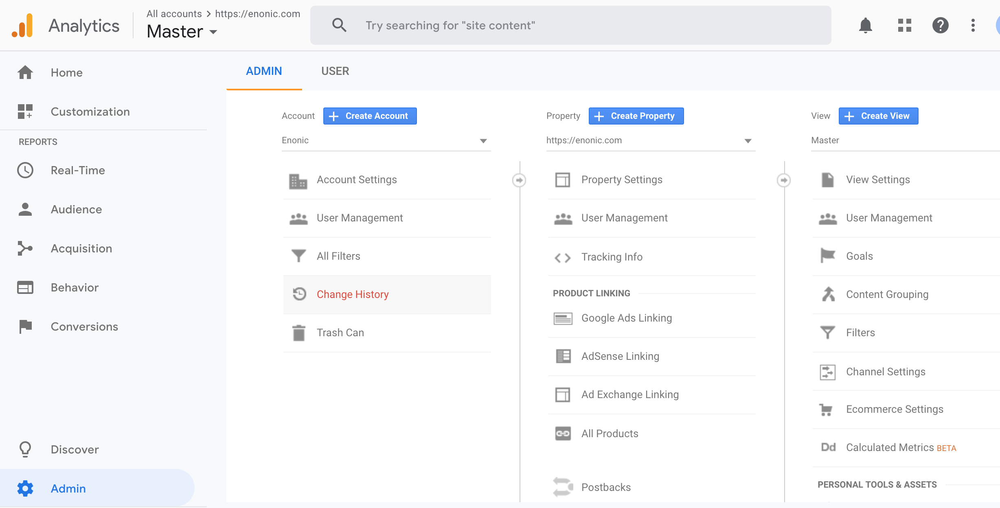
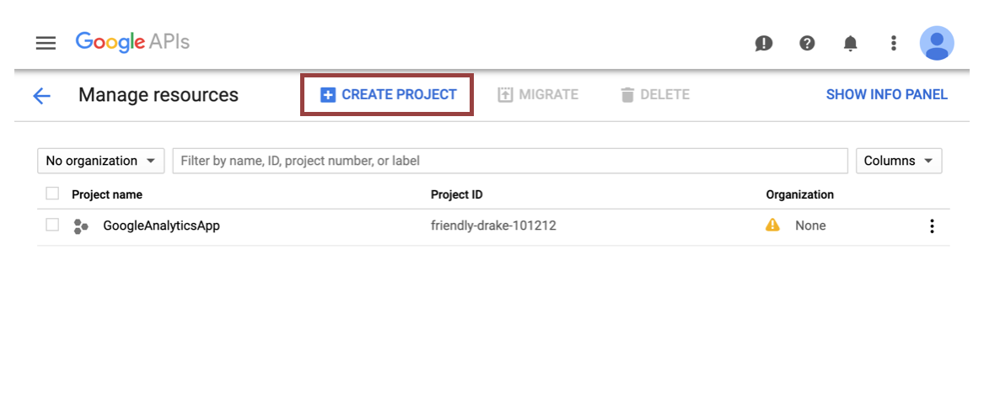
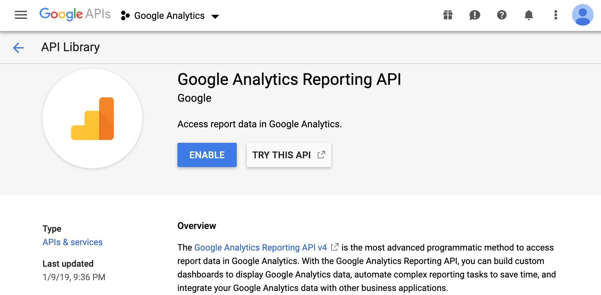
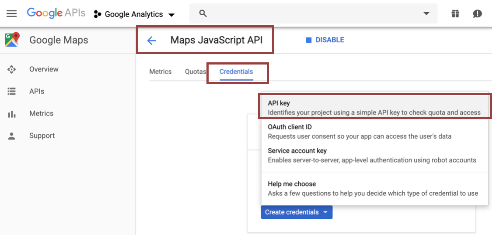
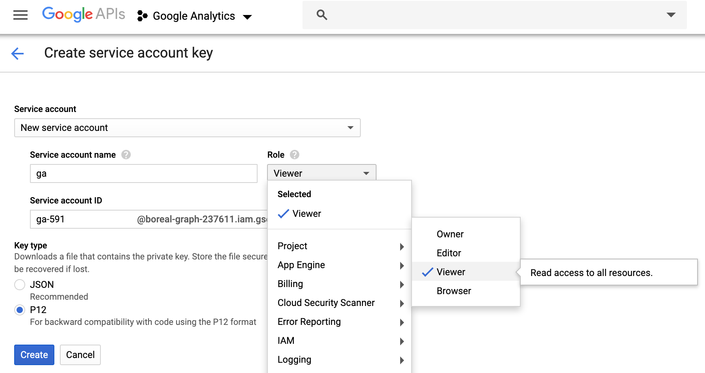
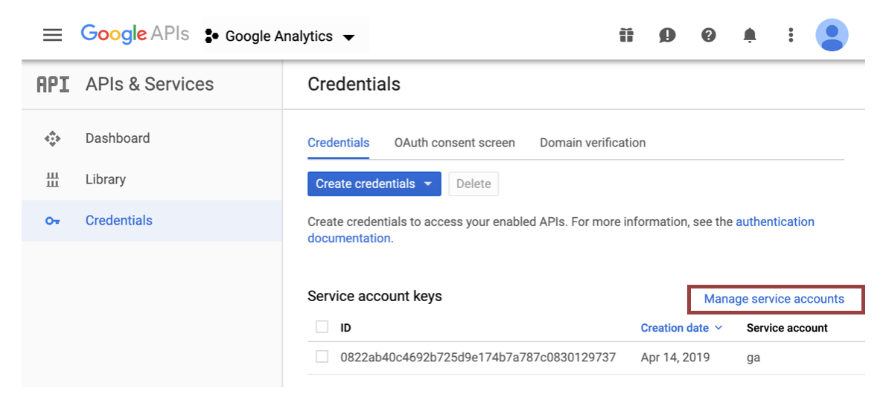
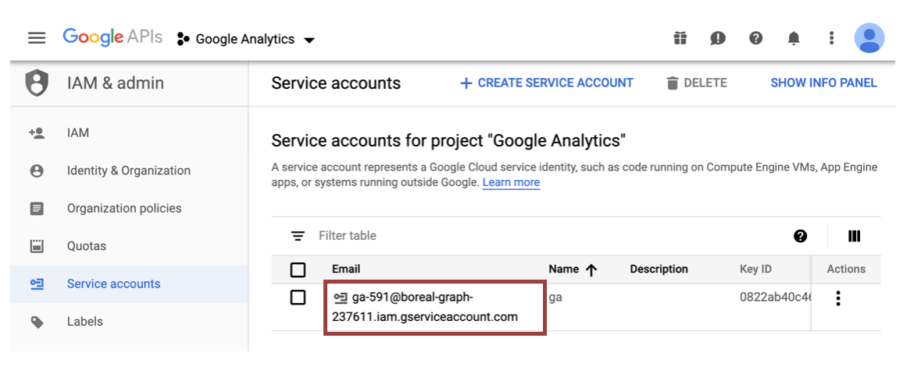
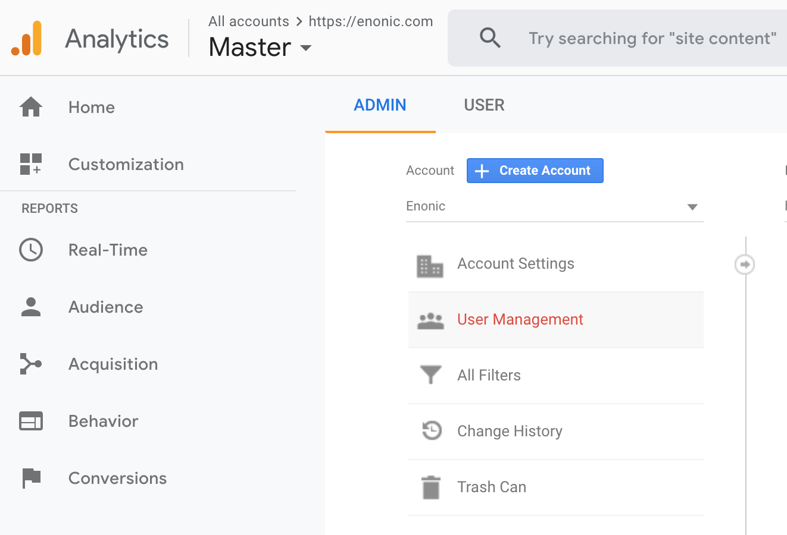
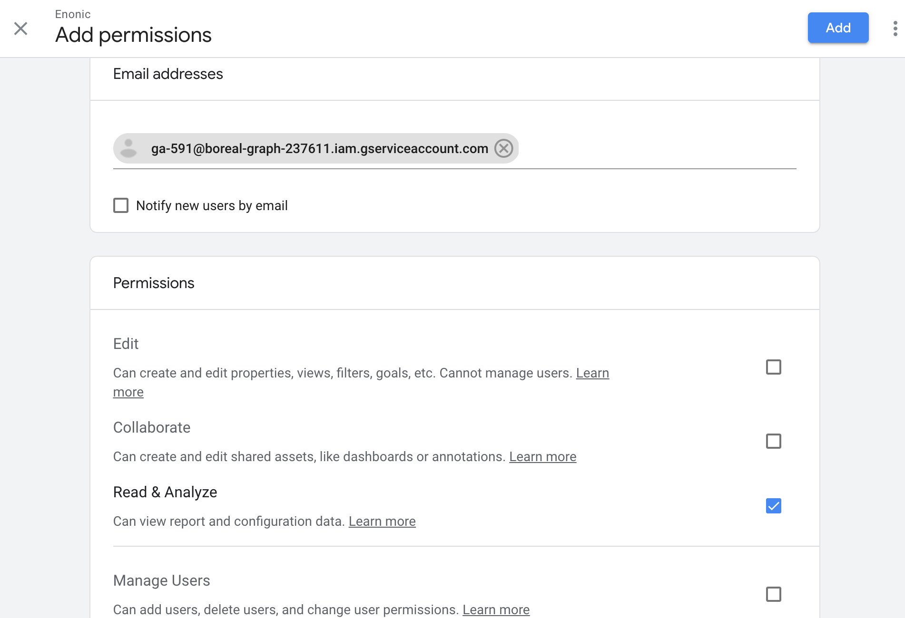
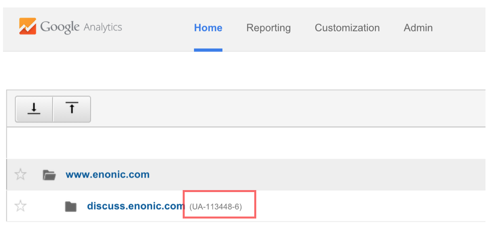

# Installing the app

*This guide assumes that you already have an account with Google Analytics, enabled tracking for at least one website (called “Property” in the GA admin dashboard) and created at least one view for the website. 
If not, please [refer to guidelines](https://www.google.com/analytics/) to set up Google Analytics first.

Before you proceed with integration, your [admin dashboard](https://analytics.google.com/analytics) should look something like this:



* [Open Google Developers Console](https://console.developers.google.com/project) and click Create Project button.



* Fill in project name (for example, “Google Analytics”) and click "Create" button to create your new project.


You will be redirected to the list of projects linked to your account.


*  Click the new project in the list. You will be redirected to the project dashboard. Note that the new project is selected in the top left corner.


Next step is to enable Google Analytics API for the project. 

* Click the burger icon in the top left corner and select "APIs & Services" from the dropdown menu.


You will see the list of APIs linked to the project (there are none yet)


* Click “Enable APIs & Services” button. You will be redirected to the API library.


* Write "Google Analytics" in the search field


* Select “Google Analytics Reporting API” from the list of results



* Click "Enable" button. The API will be enabled for the project and you'll be redirected to the API dashboard. 
If the API is already enabled, the button will say "Manage" and you don't need to do anything.

* Return to the list of APIs and enter "Maps Javascript" into the search field.
Select "Maps Javascript API" in the list and enable it in the same way as described in the previous step.


* In the "Maps Javascript API" dashboard select "Credentials" tab and click
"Create credentials" button. Select "API key".


* When the API key is created, save it somewhere - you'll need it later on.



* Go back to the "APIs & Services" page and select "Credentials" from the menu on the left-hand side.


* Click “Create Credentials” button and select “Service account” from the dropdown.


* Fill out the fields in the next screen as shown below (feel free to give your service account any name you like).


After you click the "Create" button, the file with extension .p12 will be downloaded to your PC. Rename this file to “ga_key.p12” and move it to config folder of your XP installation (xp_home/config).

* Click "Manage service accounts" link above the list of accounts



* Select email address of the service account and copy it to clipboard. You can either
copy it directly from the list or click it and copy it from the account details page.



* In the Google Analytics administration console click “User Management” under the account you want to add integration with.



This will open the list of users linked to the account. 
* Click the "+" button in the top right corner



* Paste the service account email into the textbox and uncheck all the boxes except for "Read & Analyze". Click "Add" button.


* In the config folder of your XP installation (xp_home/config) create a text file called “com.enonic.app.ga.cfg”. This file should contain the following properties:
```
    ga.serviceAccount = <service-account>
    ga.p12KeyPath = ${xp.home}/config/ga_key.p12
    ga.mapsApiKey = <maps-api-key>
```

where `ga.serviceAccount` is the service account email and `ga.mapsApiKey` is Maps Javascript API key you created earlier:

* At this point you should have two files in xp_home/config related to integration with GoogleAnalytics: ga_key.p12 and com.enonic.app.ga.cfg.



This concludes external part of the integration.

* Now [download Google Analytics App](https://github.com/enonic/app-google-analytics.git), build and deploy. The Google Analytics App should now appear in the Applications console.


* In the Content Manager of Enonic XP click Edit for a site you’re setting up integration for and select “Google Analytics App” from Site config dropdown.


* In the Google Analytics App config section enter Tracking Id of your website.


If you don’t immediately have it, you can find it in the Google Analytics Admin Dashboard


That’s it, you’re done with integration!
You should now be able to see "Google Analytics" in the detail panel of your website.


