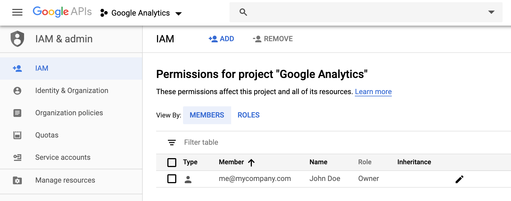
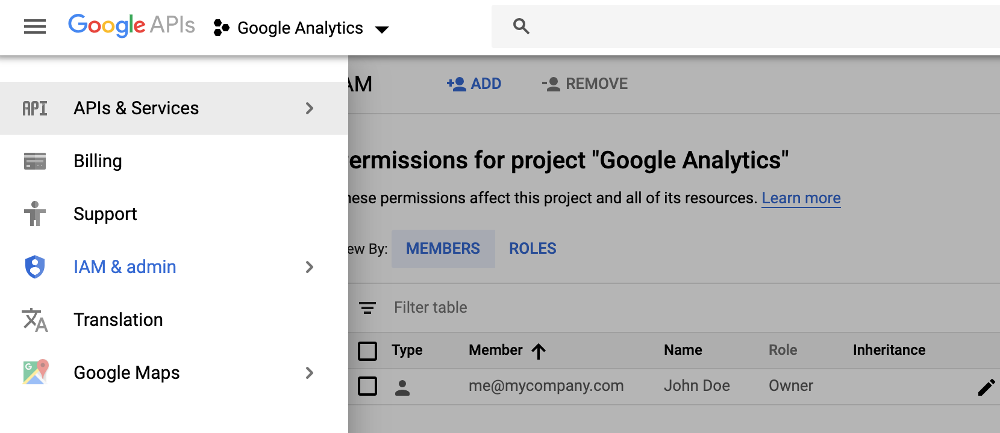
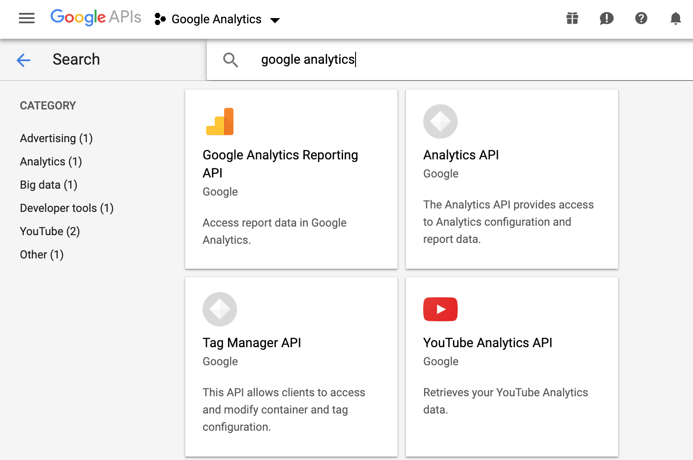
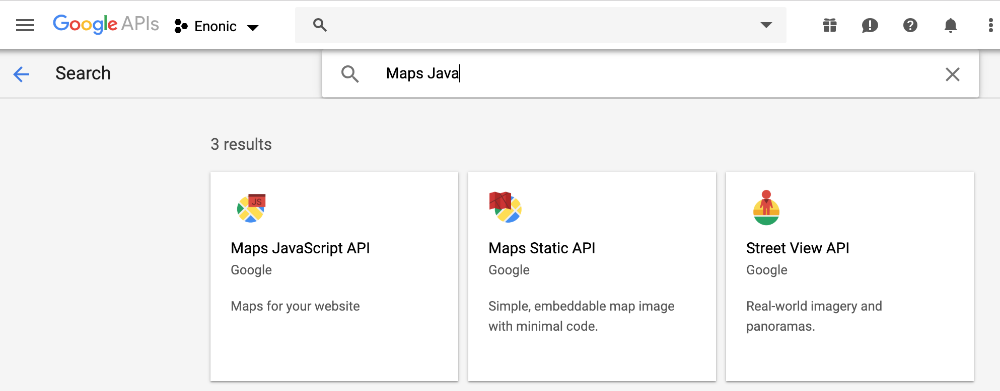
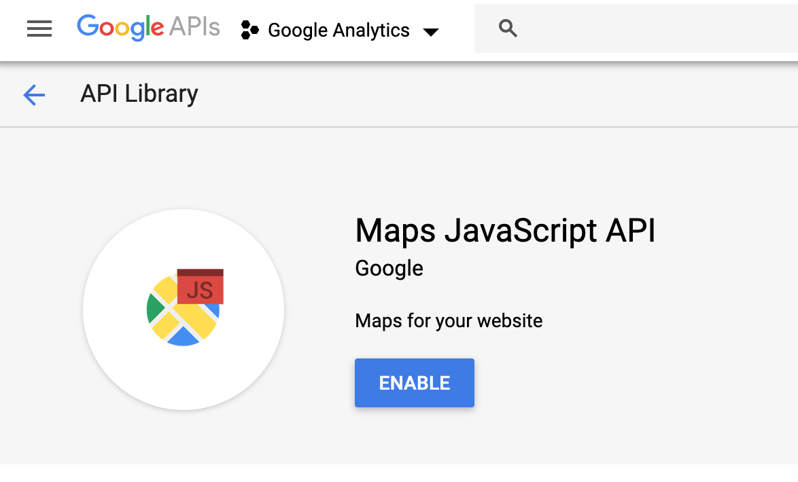
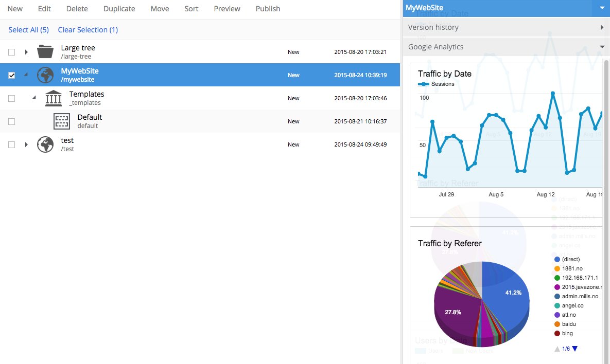

# Installing the app

*This guide assumes that you already have an account with Google Analytics, enabled tracking for at least one website (called “Property” in the GA admin dashboard) and created at least one view for the website. If not, please [refer to guidelines](https://www.google.com/analytics/) to set up Google Analytics first. Before you proceed with integration, your admin dashboard should look something like this:*


* [Open Google Developers Console](https://console.developers.google.com/project) and click Create Project button.


* Fill in project name (for example, “Google Analytics”) and create your new project.


* You will be redirected to the Project Dashboard of the new project. Next step is to enable Google Analytics API for the project. In the menu on the left-hand site click “APIs” under “APIs & auth”.


* Write “Analytics” in the search field and select “Analytics API” from the list.



* Click “Enable API” button.


* Select “Credentials” under “APIs & auth” from the menu and click “Add credentials” button.



* Select “Service account” from the dropdown.


Select P12 as a key type and click Create. The file with extension .p12 will be downloaded to the Downloads folder on your PC. Rename this file to “ga_key.p12” and move it to config folder of your XP installation (xp_home/config).


* In the new screen that opens select email address in the list and copy it to clipboard.



* In the Google Analytics administration console click “User Management” under the account you want to add integration with.


* At the bottom of the screen that opens next paste service account email from clipboard into “Add permissions for” field, then click “Add” button. This will establish the link between API service account and Google Analytics account.


* In the config folder of your XP installation (xp_home/config) create a text file called “com.enonic.app.ga.cfg”. In this file write the following content where \<service-account\> is the service account email you used previously:
```
    ga.serviceAccount = <service-account>
    ga.p12KeyPath = ${xp.home}/config/ga_key.p12
```



* At this point you’re supposed to have two files in xp_home/config related to integration with GoogleAnalytics: ga_key.p12 and com.enonic.app.ga.cfg.


This concludes external part of the integration.

* Now [download Google Analytics App](https://github.com/enonic/app-google-analytics.git), build and deploy. The Google Analytics App should now appear in the Applications console.



* In the Content Manager of Enonic XP click Edit for a site you’re setting up integration for and select “Google Analytics App” from Site config dropdown.


* In the Google Analytics App config section enter Tracking Id of your website.


If you don’t immediately have it, you can find it in the Google Analytics Admin Dashboard


That’s it, you’re done with integration!
You should now be able to see "Google Analytics" in the detail panel of your website.


